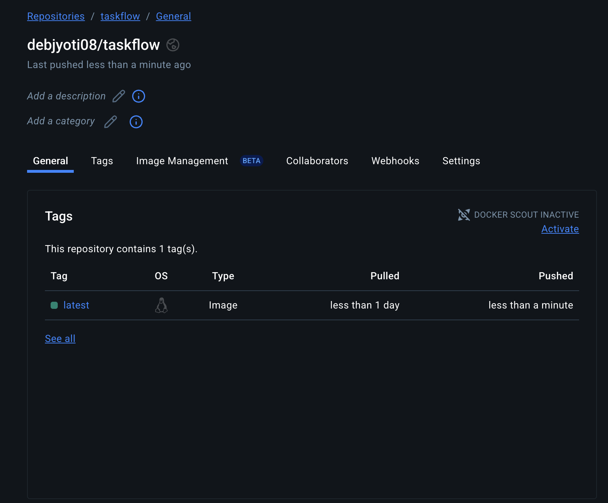
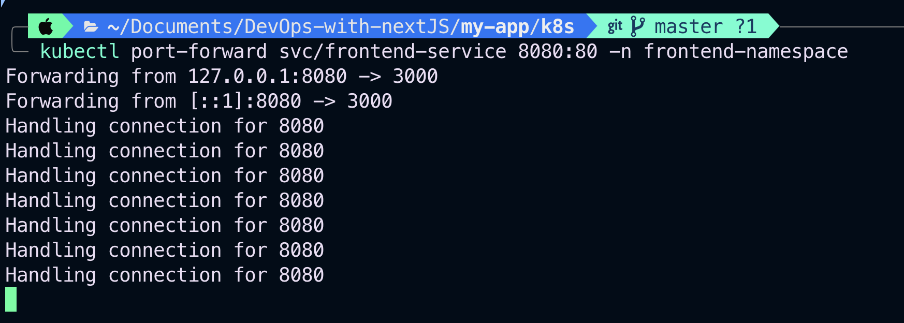

# Next.js Frontend Deployment with Docker and Kubernetes Autoscaling
This project demonstrates how to deploy a Next.js frontend application using Docker and Kubernetes, including setting up autoscaling with Horizontal Pod Autoscaler (HPA). It also includes stress testing to validate autoscaling behavior.


## Project Overview
1. Built a Next.js frontend application.
2. Containerized the app using Docker.
3. Pushed the Docker image to Docker Hub.
4. Deployed the container on Kubernetes with a Deployment and Service.
5. Configured Horizontal Pod Autoscaler (HPA) for automatic scaling based on CPU utilization.
6. Used stress tools to generate load and observe scaling behavior.

## Docker Setup
### 1 Build Docker Image
```sh
docker build -t debjyoti08/taskflow:latest .
```


### 2 Run Docker Image Locally
```sh
docker run -p 3000:3000 debjyoti08/taskflow:latest
```


### 3 Push The Image To DockerHub
```sh
docker push debjyoti08/taskflow:latest
```



## Kubernetes Deployment
### Start Minikube
```sh
minikube start
```


---
## Apply Kubernetes Manifests

### Namespace:
```sh
kubectl apply -f k8s/namespace.yaml
```
### Deployment:
```sh
kubectl apply -f k8s/deployment.yaml   
```

### Service:
```sh
kubectl apply -f k8s/service.yaml
```

### HPA:
```sh
kubectl apply -f k8s/hpa.yaml
```


### Verify Pods

```sh
kubectl get pods -n frontend-namespace
```


### Check Nodes
```sh
kubectl get nodes
```


---

## Set Up Metrics Server and Horizontal Pod Autoscaler (HPA) on Minikube (Docker Driver)
## Deploy Metrics Server
Apply the official metrics-server components:
```sh
kubectl apply -f https://github.com/kubernetes-sigs/metrics-server/releases/latest/download/components.yaml
```
## Patch Metrics Server Deployment to Fix TLS Issues
```sh
kubectl edit deployment metrics-server -n kube-system
```
### Under:
```sh
spec:
  template:
    spec:
      containers:
      - name: metrics-server
        args:
        - --cert-dir=/tmp
        - --secure-port=10250
        - --kubelet-preferred-address-types=InternalIP,ExternalIP,Hostname
        - --kubelet-use-node-status-port
        - --metric-resolution=15s

```
### Add:
```sh
 - --kubelet-insecure-tls
```

### Save and exit.
---
## Restart Metrics Server to apply changes
```sh
kubectl rollout restart deployment metrics-server -n kube-system
```
## Verify Metrics Server is Running
```sh
kubectl get pods -n kube-system | grep metrics-server
```
You should see one pod running with 1/1 ready status.


## Check Metrics Availability
```sh
kubectl top nodes
kubectl top pods -n frontend-namespace
```
You should see CPU and memory usage metrics.


---
## Stress Testing
Used stress tools inside the pod to generate CPU load for testing autoscaling:
### Forward port to pod for access:
```sh
kubectl port-forward svc/frontend-service 8080:80 -n frontend-namespace
```



### Before Load — Initial Service State


### Apply CPU load using stress command inside pod:
```sh
kubectl exec -it <pod-name> -n frontend-namespace -- stress --cpu 4 --timeout 30   
```
### Generating CPU load to trigger autoscaling.


### After Load — Service State During Scaling


### After Load — Autoscaling Back Down


 ### Autoscaler reducing replicas after load decreases.


---
